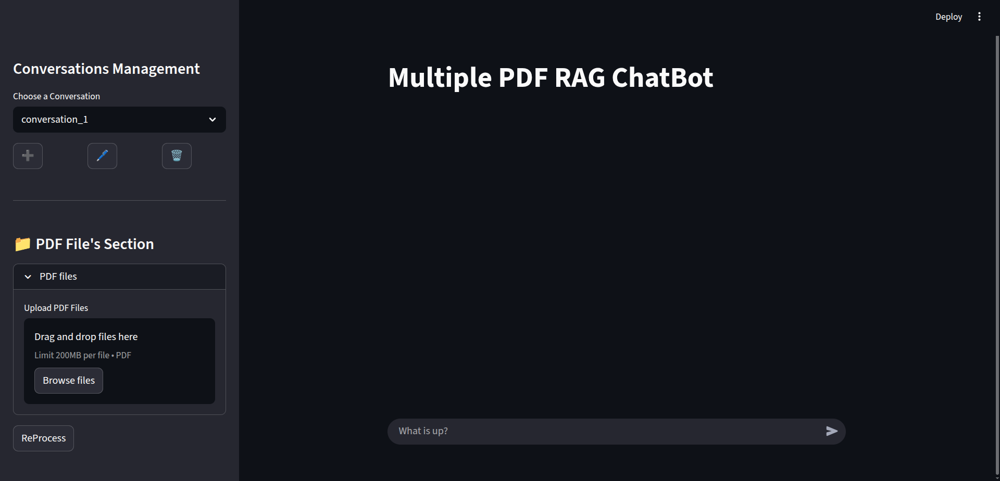
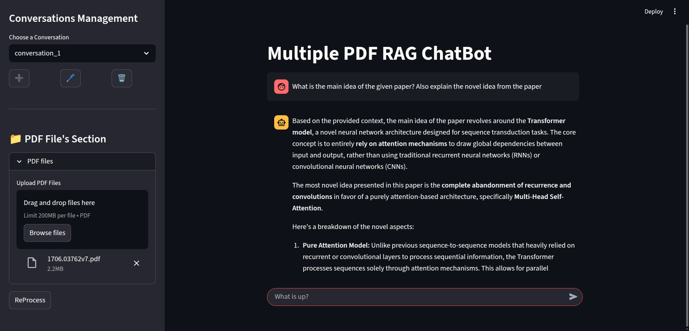

# 📚 Multiple PDF RAG Chatbot

Open in 
<a href="https://multiple-pdf-rag-chatbot-01.streamlit.app">
 
</a>

A **Retrieval-Augmented Generation (RAG) chatbot** built with **Streamlit** that allows users to upload multiple PDF documents and interact with them conversationally. The chatbot retrieves relevant context from the PDFs and generates precise answers using LLMs.

---
## Interface



---

## 🚀 Features

* 📂 Upload and chat with **multiple PDF documents** at once.
* 🔍 **Semantic search** powered by embeddings + FAISS for fast retrieval.
* 🤖 **Context-aware responses** using Retrieval-Augmented Generation.
* 💾 Session-based chat history for continuous conversation.
* ⚡ Simple and intuitive **Streamlit interface**.

---

## 🛠️ Tech Stack

* **Frontend & Hosting**: [Streamlit](https://streamlit.io/)
* **Vector Database**: [FAISS](https://github.com/facebookresearch/faiss)
* **LLM Integration**: Google (you can access Google's API key from this [link](https://aistudio.google.com/app/apikey))
* **PDF Processing**: [PyPDF2](https://pypi.org/project/pypdf2/)

---

## 📦 Installation

### 1️⃣ Clone the repository

```bash
 git clone https://github.com/hamadbijarani/Multiple-PDF-RAG-Chatbot.git
 cd Multiple-PDF-RAG-Chatbot
```

### 2️⃣ Create a virtual environment

```bash
python3 -m venv venv
source venv/bin/activate   # Linux/MacOS
venv\Scripts\activate      # Windows
```

### 3️⃣ Install dependencies

```bash
pip install -r requirements.txt
```

### 4️⃣ Set up environment variables

Create a `.env` file in the project root:

```bash
GOOGLE_API_KEY=your_google_api_key_here
```

### 5️⃣ Run the Streamlit app

```bash
streamlit run self_hosted_app.py
```

---

## ⚙️ Usage

1. Launch the app in your browser.
2. Upload one or more PDF documents.
3. Ask questions in natural language.
4. The chatbot retrieves context and generates accurate answers.



---

## 📂 Project Structure

```
Multiple-PDF-RAG-Chatbot/
  pics/
  |-- 1.png              # Picture of the new chat
  |-- 2.png              # Picture of the chat with a file uploaded
│-- self_hosted_app.py   # Self-hosted application version
|-- deployed_app.py      # Deployed app on streamlit.io
│-- requirements.txt     # Project dependencies
│-- README.md            # Project documentation
│-- LICENSE              # License of the repo
```

---

## 📝 Future Improvements

* [ ] Support for more file formats (DOCX, TXT).
* [ ] Integration with **local LLMs** for offline usage.
* [ ] UI enhancements (chat memory, source highlighting).
* [ ] Docker support for easier deployment.

---

## 🤝 Contributing

Contributions are welcome! Feel free to open issues or submit PRs.

---

## 📜 License

This project is licensed under the **Apache License 2.0**.
